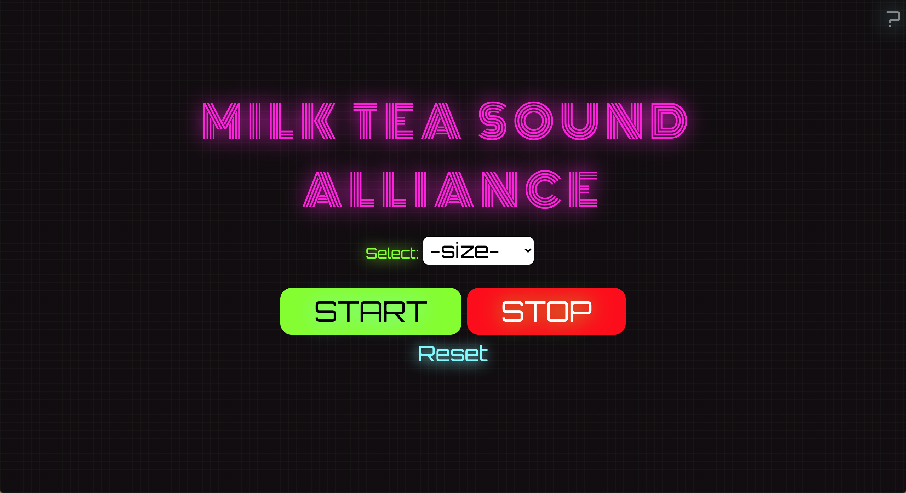

The project that assembles the variety shaking movement while making a tasty milk tea. Using a simple sensor called an accelerometer, it collects a variety of data from the mobile phone, then uses this information to generate music from that delicious milk tea.
 
<a class="website" target="_blank" href="https://milktea-sound-alliance.netlify.app/">Project Website</a>
